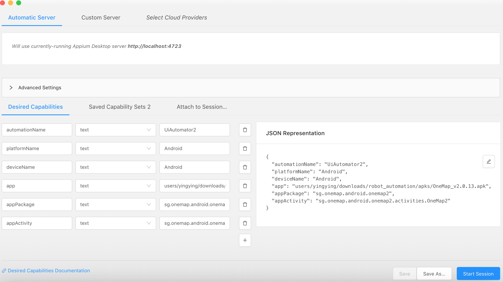
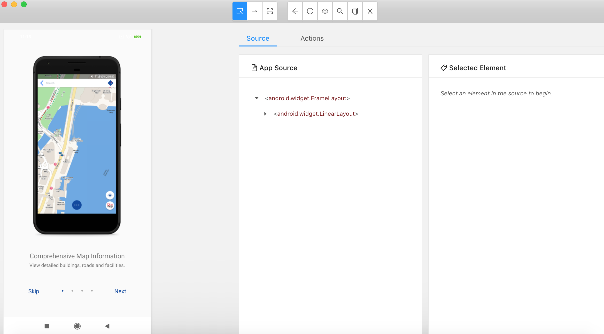
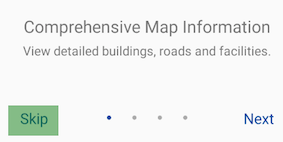
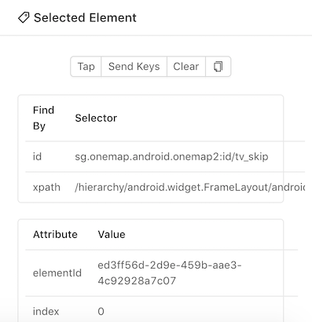
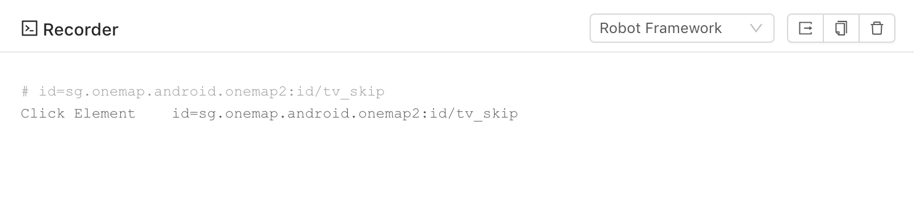
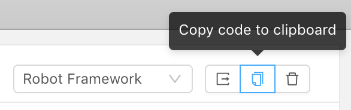
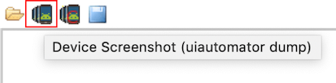
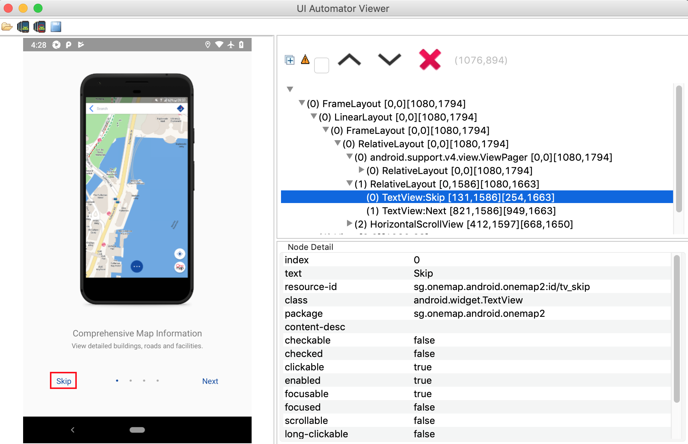
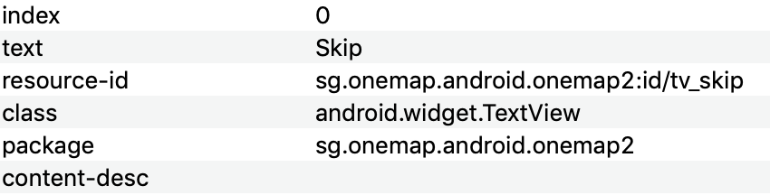

**Prerequisites**

1. Enable [USB debugging mode](https://developer.android.com/studio/debug/dev-options#debugging) on your android phones

2. Basic knowledge of [robotframework](https://robotframework.org/robotframework/latest/RobotFrameworkUserGuide.html) OR gone through our [previous section on robot framework](robotframework.md)

**To interact with elements on your mobile application and start writing test cases, you can use the following tools:**
1. [Appium Desktop](#using-appium-desktop)

2. [UiAutomatorViewer](#using-uiautomatorviewer)


## Using Appium Desktop
**Objective: Learn about Appium desktop recorder and generate robotframework codes**

**Getting Started**
1. Download [Appium Desktop](https://github.com/appium/appium-desktop/releases/tag/v1.13.0)
2. Complete the Appium installation and launch Appium Desktop
3. Ensure that you are connect to your android device
5. Click on start server
6. Click on the search icon to start inspector session

   

7. Enter the [desired capabilities](https://github.com/appium/appium/blob/master/docs/en/writing-running-appium/caps.md) as shown below and click on start session

   ```json
   {
       "automationName": "UiAutomator2",
       "platformName": "Android",
       "deviceName": "Android",
       "app": "LOCATION TO APK FILE HERE",
       "appActivity": "sg.onemap.android.onemap2.activities.OneMap2"
   }
   ```

   

8. When the session loads, a screenshot of the one map mobile application will appear on the screen. 

   

9. You have successfully connected your android device using Appium desktop

**Interacting with the device**

Now, we will interact with various UI elements and use appium to turn these interactions into robot scripts.

1. Mouse over various UI elements in your application you will see them being highlighted.

   

2. When an element is highlighted, its information will appear in the detailed view on the right side of the inspector.

   

**Using the recorder**

1. Click on the recorder icon on appium desktop

   

2. When you start recording, the inspector will show an additional window
   
   

3. The recorder will show no code until some form of action (E.g. Tap on element) is taken 

   

4. After tapping on the element, you should see the codes generated by appium recorder
   
   

5. Click on the icon as shown below to copy the robotframework code generated

   

6. Now, put together what you have learn from the [previous section on robot framework](robotframework.md) and paste in the `click element` command generated by appium desktop.

   ```robotframework   
   *** Settings ***
   Library                AppiumLibrary
   Suite Teardown         Close Application

   *** Variables ***
   #These are placeholders. HATS will detect all the devices connected and automatically create appium ports
   ${APPIUM_PORT}         4723
   ${APPIUM_SERVER}       http://localhost:${APPIUM_PORT}/wd/hub
   ${PLATFORM_VERSION}    8.0
   ${DEVICE_NAME}         Pixel_2_API_26

   *** Test cases ***
   Open android phone
       Setup and open android phone

   *** Keywords ***
   Setup and open android phone
       Open Application  ${APPIUM_SERVER}  platformName=Android  platformVersion=${PLATFORM_VERSION}  deviceName=${DEVICE_NAME}  app=./apks/OneMap_v2.0.13.apk  appPackage=sg.onemap.android.onemap2  appActivity=sg.onemap.android.onemap2.activities.OneMap2
       Click Element     id=sg.onemap.android.onemap2:id/tv_skip
    ```
7. Congrats! You may now run the test script to automate the downloading of the one map application. 

   To execute your test script check out this [section](prerequisites.md).


## Using UiAutomatorViewer

**Objective: Learn how to use UiAutomator to inspect element on mobile applications and generate XPath**

1. Download One Map App and navigate to the app once you have completed download

   

2. Launch UiAutomator by running ` uiautomatorviewer` in your command prompt or terminal
   
3. Click on the icon to obtain a screenshot of the device

   

4. You should see a screenshot of the device as shown below

   

4. View the details of the text box highlighted
   
   

5. To click on the skip text box, generate the XPath of the textbox using class and text details in the following format

   ```robotframework
   xpath=//android.widget.TextView[@text='Skip']
   ```

6. Now, put together what you have learn from the [previous section on robot framework](robotframework.md) and add in the `click element` command to click on the skip box on the app.

   ```robotframework   
   *** Settings ***
   Library                AppiumLibrary
   Suite Teardown         Close Application

   *** Variables ***
   #These are placeholders. HATS will detect all the devices connected and automatically create appium ports
   ${APPIUM_PORT}         4723
   ${APPIUM_SERVER}       http://localhost:${APPIUM_PORT}/wd/hub
   ${PLATFORM_VERSION}    8.0
   ${DEVICE_NAME}         Pixel_2_API_26

   *** Test cases ***
   Open android phone
       Setup and open android phone

   *** Keywords ***
   Setup and open android phone
       Open Application  ${APPIUM_SERVER}  platformName=Android  platformVersion=${PLATFORM_VERSION}  deviceName=${DEVICE_NAME}  app=./apks/OneMap_v2.0.13.apk  appPackage=sg.onemap.android.onemap2  appActivity=sg.onemap.android.onemap2.activities.OneMap2
       Click Element      xpath=//android.widget.TextView[@text='Skip']
    ```
7. Congrats! You may now run the test script to automate the downloading of the one map application. 

   To execute your test script check out this [section](prerequisites.md).

