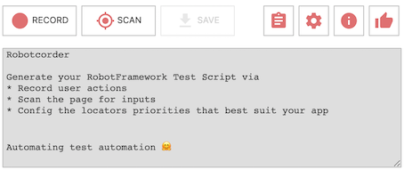
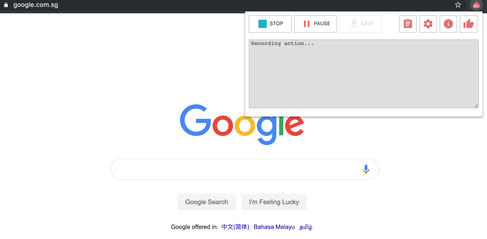
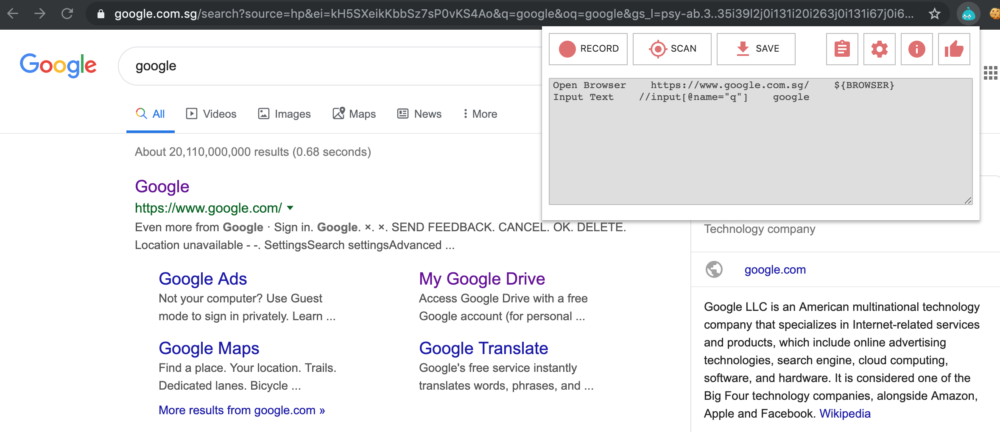

**Browser Automation Using HATS**

| Platform | Available on the following browsers                                                                           | 
| :-------:| ------------------------------------------------------------------------------------------------------------- |
| Windows  |           |
| Mac OS   |          |
| Linux    |          | 


**Prerequisites**

1. Downloaded the necessary browsers to run the test. 

2. Basic knowledge of [robotframework](https://robotframework.org/robotframework/latest/RobotFrameworkUserGuide.html) OR gone through our [previous section on robot framework](robotframework.md)

3. Enabled [remote automation](installationguide.md) on safari browser


## Using Robotcorder

**Recording actions using Robotcorder**

1. Add the [Robotcorder extension](https://chrome.google.com/webstore/detail/robotcorder/ifiilbfgcemdapeibjfohnfpfmfblmpd?hl=en) to your google chrome
2. Once you have added in the robotcorder, the extension icon should appear at the top right hand side of your browser
3. Click on the robotcorder icon and you will see the robotcorder window as shown below

   
   
4. Now, navigate to www.google.com

5. Click on the record button on robotcorder to begin recording

6. Once you click on `record`, every action performed by you will be recorded by the robotcorder

7. Input "google" into the search box

   

8. Click on `stop` to stop recording
   

9. You should see the following commands generated by the robotcorder

   ```robotframework
   Open Browser    https://www.google.com.sg/    ${BROWSER}
   Input Text      //input[@name="q"]    google
   ```

   

10. After copying the commands generated, we can proceed to write our robot script

    ```robotframework
    *** Settings ***
    Documentation     A resource file with reusable keywords and variables.
    ...
    ...               The system specific keywords created here form our own
    ...               domain specific language. They utilize keywords provided
    ...               by the imported SeleniumLibrary.
    Library           SeleniumLibrary

    *** Variables ***
    #These are placeholders. HATS update the browser and URL values based on your platform
    ${BROWSER}        Safari
    ${DELAY}          0
    ${SEARCH URL}     https://www.google.com/

    *** Keywords ***
    Open Browser To Search Page
        Open Browser         ${SEARCH URL}    ${BROWSER}
        Set Selenium Speed    ${DELAY}
        Search Page Should Be Open

    Search Page Should Be Open
        ${page_title} =  get title
        Should Contain  ${page_title}  Google

    Take a screenshot on Google's search page
        Input Text  name=q  google
        Press Key    name=q    \\13
        sleep  5sec
        ${result_title} =  get title
        should contain  ${result_title}  Python
        capture page screenshot  filename=google_search_${BROWSER}.png

    *** Test Cases ***
    Test on Google's search page
        Open Browser To Search Page
        Search Page Should Be Open
        Take a screenshot on Google's search page
        [Teardown]    Close Browser

    ```
